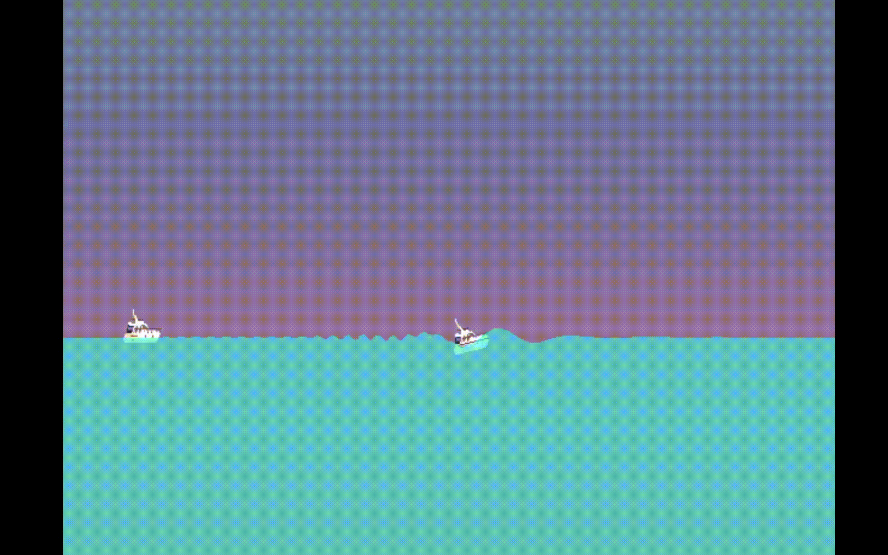

# -collision-calculator
A program meant to simulate objects in water.

## Prerequisites
SDL2 and SDL2 are required to build the project. CMake is used to build scripts.\
On Debian based systems this can be installed with 
`apt-get install libsdl2-dev` and `apt-get install libsdl2-image-dev`

## Usage
the main project is in /simulator. Once in this directory, run the following
commands to begin setup.
Generate makefiles with`cmake .`and make and run simulation target`with make sim && ./sim`

